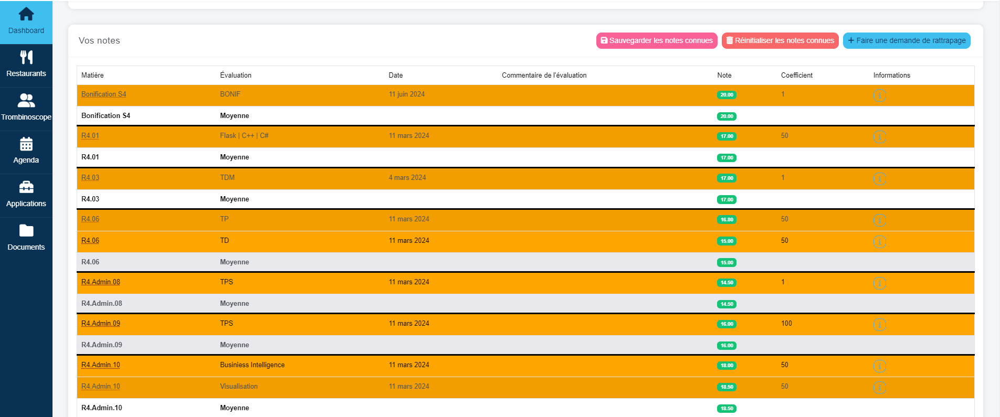

<div align="center">


# Better IUT RCC

Better IUT RCC est une extension navigateurs qui améliore l'interface de l'intranet de l'IUT RCC.

# L'extension 100% gratuite qui ne vous réclame pas des dons !

<a href="https://chromewebstore.google.com/detail/better-iut-rcc/jofahdhjofjoackgkaodimfhnbfkgnbj" target="_blank"></a>
<a href="https://github.com/PaulBayfield/Better-IUT-RCC/releases/latest" target="_blank"></a>
<a href="https://microsoftedge.microsoft.com/addons/detail/leknkclokgeajllkbhnldadkapjmlhhf" target="_blank"></a>

</div>


## Fonctionnalités

- **Moyennes** : Affiche les moyennes de chaque matière directement sur la page d'accueil.
- **Notes** : Affiche les notes de chaque matière directement sur la page d'accueil et met en surbrillance les nouvelles notes.
- **Absences** : Affiche les absences de chaque matière directement sur la page d'accueil.
- **Style** : Améliore le style de l'intranet.
- **Interface** : Améliore l'interface de l'intranet en cachant notamment les éléments inutiles.
- **Validation** : Affiche si le semestre est validé ou non.
- **Bilan** : Affiche le bilan des notes et des absences.
- **Mode minimal** : Permet de cacher les éléments redondants.
- **Menus** : Affiches les menus des restaurants universitaires à proximité des IUT.
- **Graphiques** : Affiche des graphiques pour les moyennes.


## Prévisualisation





## Installation

Vous devez disposer des dernières versions LTS de node/npm (node v20, npm v10)

```bash
npm install
```

## Compilation

Pour compiler le projet en mode développement.

```bash
npm run dev
```

Pour compiler le projet en mode production.

```bash
npm run prod
```

Pour compiler le projet en mode production et générer une archive zip.

```bash
npm run zip
```

## Crédits

Réalisé par :
- [Paul Bayfield](https://github.com/PaulBayfield)
- [Simon Ledoux](https://github.com/simon511000)

Ce projet est une fusion de deux extensions déjà existante : 
- Miaou Notes, réalisé par [Simon Ledoux](https://github.com/simon511000)
- Calcule ta moyenne [Enzo-Qlns](https://github.com/Enzo-Qlns/Iut-mark-calculator)

## License

Ce projet est sous licence [MIT](/LICENSE).
